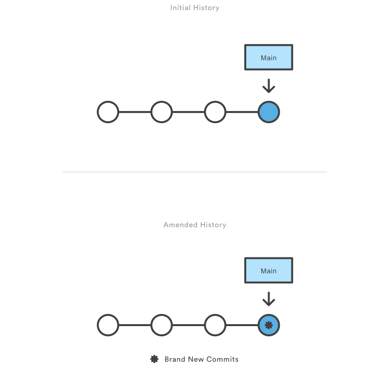

# **Система контроля версий**

**Cистема контроля версий (VCS)** — программное обеспечение для облегчения работы с изменяющейся информацией.

- **_Полная история изменений каждого файла за длительный период_**. Это касается всех изменений, внесенных огромным количеством людей за долгие годы. Изменением считается создание и удаление файлов, а также редактирование их содержимого. Различные инструменты VCS отличаются тем, насколько хорошо они обрабатывают операции переименования и перемещения файлов. В историю также должны входить сведения об авторе, дата и комментарий с описанием цели каждого изменения. Наличие полной истории позволяет возвращаться к предыдущим версиям, чтобы проводить анализ основных причин возникновения ошибок и устранять проблемы в старых версиях программного обеспечения.

* **_Ветвление и слияние_**. Создание «веток» позволяет иметь несколько независимых друг от друга направлений разработки, а также выполнять их слияние, чтобы разработчики могли проверить, что изменения, внесенные в каждую из веток, не конфликтуют друг с другом. Многие команды разработчиков программного обеспечения создают отдельные ветки для каждой функциональной возможности, для каждого релиза либо и для того, и для другого.
* **_Отслеживаемость_**. Возможность отслеживать каждое изменение, внесенное в программное обеспечение, и связывать его с ПО для управления проектами и отслеживания ошибок. История с комментариями во время чтения кода помогает понять, что этот код делает и почему действие реализовано именно таким образом. Благодаря этому разработчики могут вносить корректные и совместимые изменения в соответствии с долгосрочным планом разработки системы.

# **Подготовка к работе**

1. Скачать и установить VS Code *https://code.visualstudio.com/docs/?dv=win*

2. Скачать и установить Git *https://git-scm.com/download/win*

3. Проверить, работает ли git с помощью команды
   git --version
4. Добавить имя и email пользователя с помощью команд

   git config --global user.email "email@mail.com"

   git config --global user.name "User Name"

## **Команды**

**git init**

Эта команда создаёт в текущем каталоге новый подкаталог с именем .git, содержащий все необходимые файлы репозитория — структуру Git репозитория. На этом этапе ваш проект ещё не находится под версионным контролем.

Если вы хотите добавить под версионный контроль существующие файлы (в отличие от пустого каталога), вам стоит добавить их в индекс и осуществить первый коммит изменений. Добиться этого вы сможете запустив команду git add несколько раз, указав индексируемые файлы, а затем выполнив git commit:

**git add**

Команда git add добавляет содержимое рабочего каталога в индекс (staging area) для последующего коммита. По умолчанию git commit использует лишь этот индекс, так что вы можете использовать git add для сборки слепка вашего следующего коммита.

**git status**

Команда git status показывает
состояния файлов в рабочем каталоге и индексе: какие файлы изменены, но не добавлены в индекс; какие ожидают коммита в индексе. Вдобавок к этому выводятся подсказки о том, как изменить состояние файлов.

**git commit**

Команда git diff используется для вычисления разницы между любыми двумя Git деревьями. Это может быть разница между вашей рабочей копией и индексом (собственно git diff), разница между индексом и последним коммитом (git diff --staged), или между любыми двумя коммитами (git diff master branchB).

**git log**

После того, как вы создали несколько коммитов или же клонировали репозиторий с уже существующей историей коммитов, вероятно вам понадобится возможность посмотреть что было сделано — историю коммитов. Одним из основных и наиболее мощных инструментов для этого является команда git log.

**git checkout**

После того как вы нашли ссылку на нужный коммит в истории, для перехода к нему можно использовать команду git checkout. Команда git checkout — это простой способ «загрузить» любой из этих сохраненных снимков на компьютер разработчика.

**git checkout master**

переключение на ветку master в последний коммит

**git diff**

Показывает различия между проиндексированной и последней зафиксированной версиями файлов

**git diff [первая ветка]...[вторая ветка]**

Показывает разницу между содержанием коммитов двух ветокgit

**show [коммит]**

Выводит информацию и показывает изменения в выбранном коммите

**git branch**

Список именованных веток коммитов с указанием выбранной ветки

**git branch [имя ветки]**

Создаёт новую ветку

**git merge [имя ветки]**

Вносит изменения указанной ветки в текущую ветку

**git branch -d [имя ветки]**

Удаляет выбранную ветку

**git commit --amend**

Команда *git commit --amend* — это удобный способ изменить последний коммит. Она позволяет объединить проиндексированные изменения с предыдущим коммитом без создания нового коммита. Ее можно использовать для редактирования комментария к предыдущему коммиту без изменения состояния кода в нем. Но такое изменение не только редактирует последний коммит, но и полностью его заменяет. То есть измененный коммит станет новой сущностью с отдельной ссылкой. Для Git он будет выглядеть как новый коммит, который отмечен звездочкой (*) на схеме внизу.

Например, команда *git commit --amend -m "an updated commit message"* позволяет изменить комментарий последего коммита на *"an updated commit message"*.